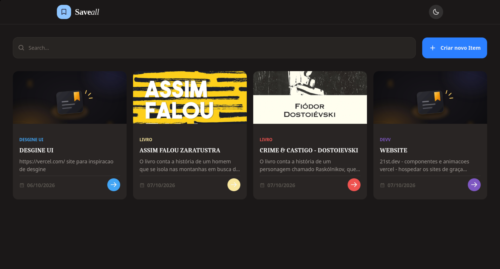
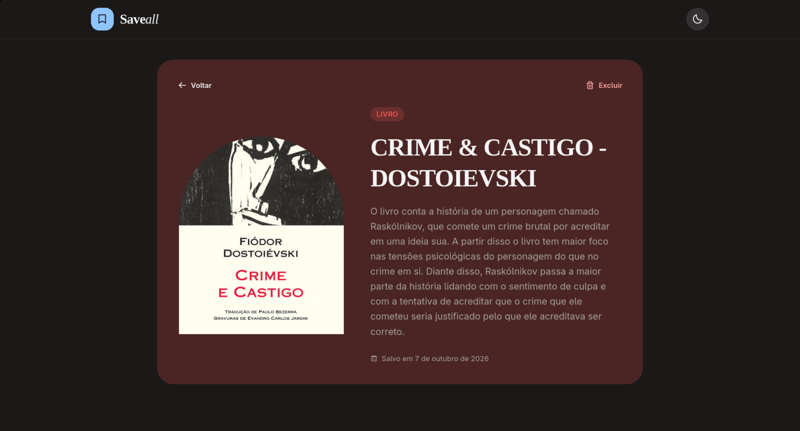

# Save-All

A full-stack web application for creating and organizing personalized cards.

## About

Save-All allows users to create cards with a title, description, category, image, and custom color. Cards are stored in MongoDB and can be searched by title, description, or category.

## Preview

### Cards

  
  

## Technologies

- React
- Vite
- Tailwind CSS
- Node.js
- Express
- MongoDB
- Mongoose
- JavaScript

## Features

- Create cards
- Search cards
- Categorize cards
- Add images
- Customize card colors
- Store cards in MongoDB
- Automatically record the creation date

## Installation

Clone the repository:

git clone https://github.com/ryankennedydev/save-all.git
